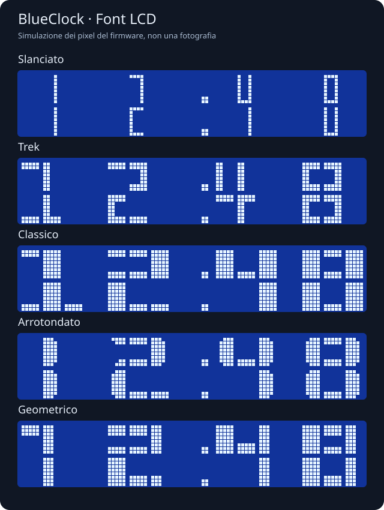
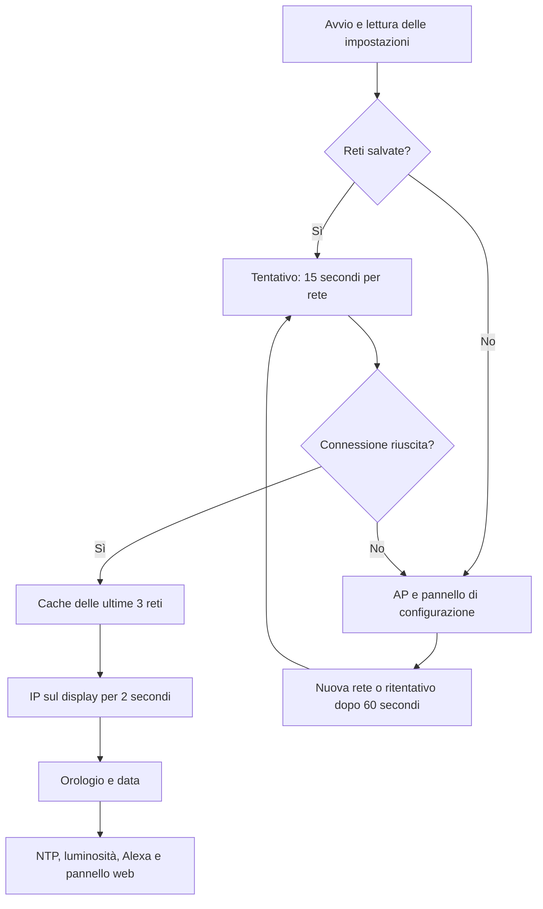

# BlueClock

Un semplice orologio Wi-Fi con **ESP8266 e display LCD 16×2**, configurabile dal browser e controllabile con Alexa. Progetto di [spacecdr](https://github.com/spacecdr).

BlueClock nasce per riutilizzare una piccola scheda Wi-Fi e un display a caratteri: mostrare bene l'ora, alternare una data in italiano e abbassare la luce la sera, senza ricompilare il firmware ogni volta che cambia la rete o una preferenza.

## Funzioni

| Funzione | Caratteristiche |
| --- | --- |
| Wi-Fi | Cache delle ultime **3 reti** connesse con successo; configurazione via AP |
| Ora | NTP ogni **15 minuti** oppure impostazione manuale |
| Fuso | Italia, UTC, Londra, New York, Los Angeles e Tokyo |
| Display | **8 font**, puntini lampeggianti/fissi/spenti |
| Data | Giorno e mese in italiano, anno opzionale, intervalli configurabili |
| Luminosità | Fissa 0–100% o fino a **6 fasce orarie** |
| Alexa | Flag e nome configurabili; accensione, spegnimento e dimmer |
| Memoria | Reti e preferenze salvate in LittleFS |
| Pannello | Interfaccia web in italiano per telefono e computer |

## Hardware

| Componente | Specifiche del prototipo |
| --- | --- |
| Scheda | Formato D1 mini, ESP8266EX, flash 4 MB |
| Display | LCD 1602: 16 colonne × 2 righe, compatibile HD44780 |
| Interfaccia | Backpack I²C, famiglia PCF8574, con trimmer del contrasto |
| Alimentazione | USB 5 V alla scheda |
| LED | Integrato, attivo basso, D4/GPIO2 |
| Bus dati | SDA su D2/GPIO4; SCL su D1/GPIO5 |
| Montaggio | Cavetti e contenitore del prototipo |

La [guida hardware](docs/HARDWARE.md) descrive cablaggio, alimentazione e limiti. Non è richiesto un RTC esterno.

## Primo avvio

1. Alimenta BlueClock tramite USB. Se non trova una rete salvata, apre il proprio access point.
2. Leggi sul display **nome Wi-Fi, password e IP**. Collegati a quella rete anche se il telefono segnala assenza di Internet.
3. Apri **http://192.168.4.1**, scegli una rete di casa a **2,4 GHz**, inserisci la password e avvia il collegamento.
4. Il display mostra `Connetto...` con i secondi trascorsi, poi l'IP per due secondi e infine l'orologio.
5. Ricollega il telefono alla rete di casa e apri nel browser l'IP mostrato da BlueClock.

Nome e password dell'AP derivano dall'identificativo della scheda: usa quelli visualizzati sul tuo dispositivo. Non occorre inserire credenziali nel codice.

## Ora, data e font

In modalità automatica l'ora viene richiesta alla connessione e ogni 15 minuti dall'ultimo successo. Dopo un errore il firmware riprova tra un minuto. In modalità manuale puoi impostare data e ora nel fuso selezionato dal pannello.

Il fuso predefinito è **Europe/Rome**, con regole di ora legale. Sono disponibili anche UTC, Europe/London, America/New_York, America/Los_Angeles e Asia/Tokyo.

| ID | Stile | Formato |
| --- | --- | --- |
| 0 | Pieno | Grande, su due righe |
| 1 | Sottile | Grande, su due righe |
| 2 | Compatto | Ore, minuti e secondi |
| 3 | Slanciato | Cifre 1×2 caratteri |
| 4 | Trek | Cifre 2×2 caratteri |
| 5 | Classico | Cifre 3×2 caratteri |
| 6 | Arrotondato | Cifre 3×2 caratteri |
| 7 | Geometrico | Cifre 3×2 caratteri |

I separatori possono lampeggiare, restare fissi o essere spenti. La data è opzionale: dopo 5–3600 secondi di orologio viene mostrata per 2–60 secondi. Con l'anno abilitato, per esempio:

```text
Venerdì 2026
25 Settembre
```

I cinque font aggiuntivi sono adattati da [LCDBigNumbers](https://github.com/ArminJo/LCDBigNumbers). Font e accento della data condividono gli otto caratteri programmabili dell'LCD: il firmware li ricarica al cambio vista.



L'anteprima è generata dalle tabelle del firmware tramite `tools/render-fonts.cpp`; non è una fotografia del dispositivo.

## Luminosità e Alexa

Puoi scegliere un livello fisso oppure fino a sei fasce giornaliere. Ogni fascia dura fino alla successiva, anche oltre mezzanotte. Esempio: **07:00 → 100%**, **22:00 → 20%**. Durante configurazione, collegamento o assenza di un'ora valida, la luce resta al 100% per rendere leggibili le istruzioni.

Nella sezione Alexa abilita il flag, scegli un nome, per esempio **Orologio cucina**, e salva. BlueClock si riavvia; avvia quindi la ricerca dei dispositivi nell'app Alexa. Con un Echo compatibile sulla stessa rete locale puoi usare:

- «Alexa, accendi Orologio cucina».
- «Alexa, imposta Orologio cucina al 30 per cento».
- «Alexa, spegni Orologio cucina».

Un comando Alexa passa alla **luminosità fissa** e salva il livello. Per tornare alle fasce riattiva la modalità automatica dal pannello. Flag e nome Alexa restano salvati dopo lo spegnimento. L'integrazione usa Espalexa e l'emulazione locale Hue: la scoperta dipende dal modello Echo e dal supporto multicast della rete. Se cambi nome può essere necessario rimuovere il vecchio dispositivo nell'app e ripetere la ricerca.

## Logica di funzionamento



Il LED lampeggia durante AP e connessione, si spegne a Wi-Fi connesso e si accende durante una richiesta NTP. La [documentazione della logica](docs/ARCHITECTURE.md) approfondisce stati, salvataggi e API.

## Compilazione e caricamento

Installa [PlatformIO](https://docs.platformio.org/en/latest/core/installation/index.html), oppure usa l'estensione per Visual Studio Code:

```sh
git clone https://github.com/spacecdr/BlueClock.git
cd BlueClock
pio run
pio run -t upload
pio device monitor --baud 115200
```

Se ci sono più porte seriali, indica quella della scheda:

```sh
pio run -t upload --upload-port /dev/PORTA_DELLA_SCHEDA
```

La configurazione usa `d1_mini`, core Arduino ESP8266 e versioni delle librerie fissate in [platformio.ini](platformio.ini). Il pannello è incorporato nel firmware: **non occorre caricare separatamente il filesystem**. Al primo avvio viene inizializzato LittleFS, se necessario. Prima di sostituire un firmware esistente conserva un backup locale della flash.

## Test e stato

```sh
c++ -std=c++14 -fsanitize=address,undefined tests/clock_logic_test.cpp -o /tmp/blueclock-logic
/tmp/blueclock-logic
c++ -std=c++14 -fsanitize=address,undefined tests/display_test.cpp -o /tmp/blueclock-display
/tmp/blueclock-display
```

I test verificano fasce, mezzanotte, overflow dei timer, cambio era NTP del 2036 e 43.200 frame dei cinque font aggiuntivi. GitHub Actions esegue test e compilazione; le build riuscite producono un artefatto firmware scaricabile. I dump della flash del prototipo restano esclusi dal repository.

Sul prototipo sono stati verificati caricamento, LCD, filesystem, Wi-Fi, NTP e salvataggio delle opzioni. [TESTING.md](docs/TESTING.md) distingue le verifiche eseguite dalle prove fisiche ancora necessarie.

## Limiti

- **Senza RTC con batteria**, dopo aver tolto alimentazione occorre recuperare l'ora da NTP o impostarla manualmente. Le preferenze restano salvate.
- **Dimmer software:** i livelli intermedi commutano la retroilluminazione a circa 100 Hz e possono sfarfallare durante operazioni Wi-Fi o LCD. Un dimmer hardware stabile richiede modifiche al circuito.
- **Accesso locale:** il pannello HTTP non ha login. Le password Wi-Fi restano nella flash, anche se non sono restituite dalle API. Non esporre il pannello tramite port forwarding.
- **Password AP:** essendo derivata dall'identificativo della scheda, è prevedibile; non va considerata una credenziale ad alta sicurezza.

## Struttura e licenza

```text
src/             Firmware, logica, font e pannello
tests/           Test eseguibili sul computer
docs/            Hardware, architettura e collaudo
third_party/     Font originali e attribuzioni
.github/         Compilazione e test automatici
platformio.ini   Scheda, framework e dipendenze
```

Codice distribuito con licenza **GPL-3.0-or-later**, coerente con i font incorporati. Vedi [LICENSE](LICENSE) e [THIRD_PARTY.md](THIRD_PARTY.md).
