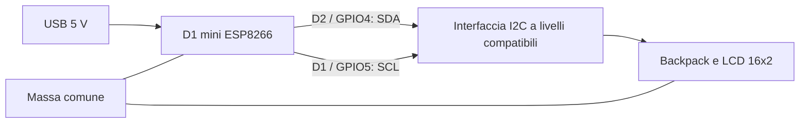

# Hardware di BlueClock

## Componenti

- Scheda ESP8266 formato D1 mini con 4 MB di flash.
- Display LCD 1602 compatibile HD44780.
- Backpack I²C della famiglia PCF8574 con trimmer del contrasto.
- Cavetti, connettori/saldature, contenitore e alimentazione USB 5 V.
- Cavo USB dati per la programmazione.

Non servono sensore di luce, RTC o batteria: la luminosità automatica segue l'orario e l'ora arriva dalla rete. Il trimmer del backpack regola il contrasto, non la luminosità software.

## Collegamenti

| D1 mini | GPIO | Backpack |
| --- | --- | --- |
| D2 | 4 | SDA |
| D1 | 5 | SCL |
| GND | — | GND |
| Alimentazione adatta al modulo | — | VCC |

I pin dati sono quelli configurati e verificati sul prototipo. `hd44780_I2Cexp` rileva indirizzo e mappatura del backpack: non è necessario imporre `0x27` nel codice.

**Livelli elettrici:** i GPIO ESP8266 lavorano a 3,3 V. Verifica tensione richiesta dal tuo LCD e pull-up del backpack. Un modulo alimentato a 5 V può portare anche SDA/SCL a 5 V: in questo caso usa un traslatore I²C bidirezionale con pull-up corretti sui due lati. La foto del prototipo non dimostra quali tensioni siano presenti. Non collegare direttamente un bus a 5 V ai GPIO.

## LED e retroilluminazione

Il LED integrato è attivo basso su D4/GPIO2. Lampeggia in AP o durante il collegamento, e resta acceso durante una richiesta NTP fino a successo o timeout.

Il firmware regola il bit di retroilluminazione tramite I²C. A 0% e 100% non serve commutazione periodica; ai livelli intermedi la frequenza nominale è 100 Hz. Wi-Fi e pannello possono ritardarla. Un controllo hardware con transistor e pin dedicato è un'estensione futura.

## Fotografie

Le foto reali del prototipo sono destinate a `docs/images/`. Lo schema sopra descrive i collegamenti logici; non è una fotografia né uno schema elettrico completo.
